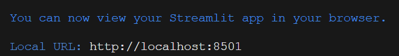

# Azure AI Services Streamlit Demos [Under development]

This repository contains demos for Azure Language, Computer Vision, AI Search, Document Intelligence and OpenAI services in a Streamlit application.

Streamlit is an open-source Python framework for data scientists and AI/ML engineers to deliver interactive data apps without worrying about UI or routing. More information about Streamlit can be found [here](https://streamlit.io/#install).

## Folder structure

```
azure-ai-streamlit-demos/
├─ images 
├─ pages
│  ├─ sample_data
│  ├─ 01-👀 Computer Vision
│  ├─ 02-🔠 Language
│  ├─ 03-🔎 Knowledge Mining
│  ├─ 04-🦾GenerativeAI
│  ├─ 05-📑Document Intelligence
├─ Home.py #home/main page
├─ .gitignore
├─ requirements.txt
├─ README.md
```


## Getting Started

Follow the steps below to set up and use the demos.

### Prerequisites

- Python (>= 3.8)
- Visual Studio Code

### Installation

1. Clone this repository to your local machine.

```bash
git clone https://github.com/maihh97/azure-ai-streamlit-demos.git
```

2. Navigate to the project directory.

```bash
cd azure-ai-streamlit-demos
```

3. Create a virtual environment.

```bash
python3 -m venv <name_of_your_env>
```

4. Activate the virtual environment.

- On Windows:

```bash
<name_of_your_env>\Scripts\activate
```

- On macOS/Linux:

```bash
source <name_of_your_env>/bin/activate
```

5. Install project dependencies from the requirements.txt file.

```bash
pip install -r requirements.txt
```

6. Create a .env file in the root directory of your project to store sensitive information such as the endpoints and keys. An example .env file can contain the following:

```
AZURE_OPENAI_ENDPOINT=<your_azure_openai_endpoint>
AZURE_OPENAI_KEY=<your_azure_openai_key>
```

Note: Never share your `.env` file publicly or commit it to version control systems like Git, as it contains sensitive information. The best practice is to use a `.gitignore` file in your repo to avoid commiting the `.env` file.

7. Run streamlit in the virtual environment using the following command

```base
streamlit run Home.py
```

If successful you should see the following message in the terminal and access the URL localhost:8501.




